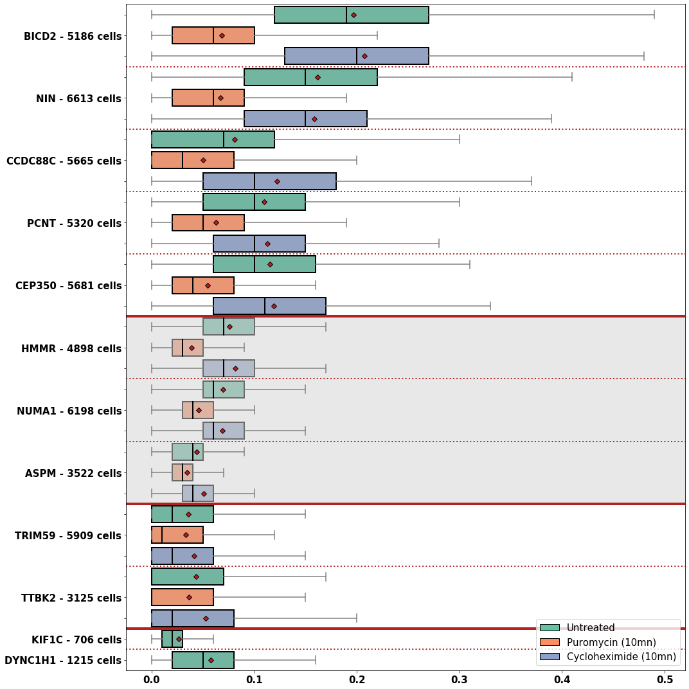

# Methods, plots and numerical results for Safieddine et al. (2020)

This repository gathers the code used for the following paper:

__Title:__ A choreography of centrosomal mRNAs reveals a conserved localization mechanism involving active polysome transport

__Authors:__ [Adham Safieddine](mailto:safieddine.adham@gmail.com)1,2,\*, Emeline Coleno1,2, Soha Salloum1,2,3,+, Arthur Imbert4,5,6,+, Abdel-Meneem Traboulsi1,2, Oh Sung Kwon7, Frederic Lionneton8, Virginie Georget8, Marie-Cécile Robert1,2, Thierry Gostan1, Charles Lecellier1,2, Racha Chouaib1,2,5, Xavier Pichon1,2, Hervé Le Hir3 , Kazem Zibara5, Florian Müller9,10, Thomas Walter4,5,6, Marion Peter1,2, [Edouard Bertrand](mailto:edouard.bertrand@igmm.cnrs.fr)1,2,11,\*

>1Institut de Génétique Moléculaire de Montpellier, University of Montpellier, CNRS, Montpellier, France
2Equipe labélisée Ligue Nationale Contre le Cancer, University of Montpellier, CNRS, Montpellier, France
3ER045, PRASE, DSST, Faculty of Sciences-I, Lebanese University, Beirut, Lebanon
4MINES ParisTech, PSL-Research University, CBIO-Centre for Computational Biology, 77300 Fontainebleau, France
5Institut Curie, 75248 Paris Cedex, France
6INSERM, U900, 75248 Paris Cedex, France
7Institut de biologie de l'Ecole normale supérieure (IBENS), Ecole normale supérieure, CNRS, INSERM, PSL Research University, 46 rue d'Ulm, 75005, Paris, France
8BioCampus Montpellier, CNRS UMS3426, 141, rue de la Cardonille, 34094 Montpellier Cedex 5, France
9Unité Imagerie et Modélisation, Institut Pasteur and CNRS UMR 3691, 28 rue du Docteur Roux, 75015 Paris; France
10C3BI, USR 3756 IP CNRS – Paris, France
11Institut de Génétique Humaine, University of Montpellier, CNRS, Montpellier, France
>
>+Equal contributions
\*To whom correspondence should be addressed.

## Prerequisites

The analysis pipeline consists of three different resources that are best run
in dedicated virtual environments:

- [**BigFISH**](https://github.com/fish-quant/big-fish), a python library to process smFISH images. It allows to detect mRNAs and centrosomes in 2D, format segmentation masks and compute spatial features at the cell-level.
    - Run the command `pip install big-fish==0.4.0` in an empty virtual environment to reproduce our python environment and run BigFISH methods.
- [**Cellpose**](http://www.cellpose.org/), a Deep Learning based approach for nuclei and cells segmentation.
    - Run the command `pip install -r requirements_cellpose.txt` in an empty virtual environment to reproduce our python environment and run Cellpose model.
- A more general environment with classic scientific libraries to perform statistical tests and plot results. We use it as a kernel for the final Ipython notebook _results.ipynb_.
    - Run the command `pip install -r requirements_notebook.txt` in an empty virtual environment to reproduce our python environment and run the _results.ipynb_ notebook.

## Dataset

The analysis is performed on 2D images obtained with a Maximum Intensity Projection (MIP). In a high-throughput screening framework, the pipeline can scale to several plates and hundreds of wells. All images have four channels with dedicated purposes:
- smFISH - mRNAs detection
- Dapi - nuclei segmentation
- GFP - centrosomes detection and cells segmentation
- CellMask - cells segmentation

If you have any question relative to the image acquisition, please contact [Edouard Bertrand](mailto:edouard.bertrand@igmm.cnrs.fr) or [Adham Safieddine](mailto:safieddine.adham@gmail.com).

## Pipeline

Below, we provide a quick overview of the different steps in the analysis, and
in which environment they are performed. A more detailed description of each
step is provided in the following sections:

1. **Preprocessing** (BigFISH)
2. **Spot detection** (BigFISH)
3. **Segmentation** (Cellpose)
4. **Postprocessing** (BigFISH)
5. **Features** (BigFISH)
6. **Plot** (notebook)

If you have any question relative to the image analysis, please contact [Arthur Imbert](mailto:arthur.imbert.pro@gmail.com) or [Adham Safieddine](mailto:safieddine.adham@gmail.com) (or open an issue).

### 1. Preprocessing

Images are first renamed according to their plate, well, gene, treatment and field of view:
- bigfish_scripts/rename_images.py

To fit with the segmentation template of Cellpose, images are organized in different folders, one folder per well:
- bigfish_scripts/preprocess_nuc.py
- bigfish_scripts/preprocess_cell.py

A last script allows us to visualize all our MIPs:
- bigfish_scripts/plot_mip.py

| Dapi | smFISH | GFP | CellMask |
| ------------- | ------------- | ------------- | ------------- |
|  |  |   |  |

### 2. Spot detection

A first script detect mRNAs spots, decompose clustered regions and detect foci from smFISH channel:
- bigfish_scripts/detect_rna.py

A second script detect centrosomes in the GFP channel:
- bigfish_scripts/detect_centrosome.py

 and centrosome (right)")

### 3. Segmentation

We use the Cellpose model to segment nuclei and cells. An [**API**](http://www.cellpose.org/) is available online or the [**github repository**](https://github.com/MouseLand/cellpose) can be clone locally. 

### 4. Postprocessing

Integer masks obtained from the segmentation are cleaned and we ensure every segmented cell match a nucleus:
- bigfish_scripts/postprocess_segmentation.py

")

We assign detected mRNAs and centrosomes to an unique pair of cell and nucleus:
- bigfish_scripts/extract_cell.py
- bigfish_scripts/merge_df_extraction.py

Specific plots can be saved for every segmented cell:
- bigfish_scripts/plot_extraction.py

### 5. Features

Based on the detection and segmentation results, spatial features around the centrosomes can be computed:
- bigfish_scripts/compute_features.py
- bigfish_scripts/merge_df_features.py

### 6. Plot

The .csv file provided is a cleaned version of the merged dataframe we obtain at the end of the pipeline. It allows us to directly run the notebook and build the synthetic plot:
- notebook/results.ipynb

## Results

## Licensing

- **BigFISH** and the rest of the code provided in this repository (notebook) are BSD-licenced (3 clause):
>Copyright © 2020, Arthur Imbert  
>All rights reserved.
>
>Redistribution and use in source and binary forms, with or without
>modification, are permitted provided that the following conditions are met:
>    * Redistributions of source code must retain the above copyright
      notice, this list of conditions and the following disclaimer.
>    * Redistributions in binary form must reproduce the above copyright
      notice, this list of conditions and the following disclaimer in the
      documentation and/or other materials provided with the distribution.
>    * Neither the name of the copyright holder nor the names of its
      contributors may be used to endorse or promote products derived from
      this software without specific prior written permission.
>
>THIS SOFTWARE IS PROVIDED BY THE COPYRIGHT HOLDERS AND CONTRIBUTORS "AS IS" AND
ANY EXPRESS OR IMPLIED WARRANTIES, INCLUDING, BUT NOT LIMITED TO, THE IMPLIED
WARRANTIES OF MERCHANTABILITY AND FITNESS FOR A PARTICULAR PURPOSE ARE
DISCLAIMED. IN NO EVENT SHALL COPYRIGHT OWNER OR CONTRIBUTORS BE LIABLE FOR ANY
DIRECT, INDIRECT, INCIDENTAL, SPECIAL, EXEMPLARY, OR CONSEQUENTIAL DAMAGES
(INCLUDING, BUT NOT LIMITED TO, PROCUREMENT OF SUBSTITUTE GOODS OR SERVICES;
LOSS OF USE, DATA, OR PROFITS; OR BUSINESS INTERRUPTION) HOWEVER CAUSED AND
ON ANY THEORY OF LIABILITY, WHETHER IN CONTRACT, STRICT LIABILITY, OR TORT
(INCLUDING NEGLIGENCE OR OTHERWISE) ARISING IN ANY WAY OUT OF THE USE OF THIS
SOFTWARE, EVEN IF ADVISED OF THE POSSIBILITY OF SUCH DAMAGE.